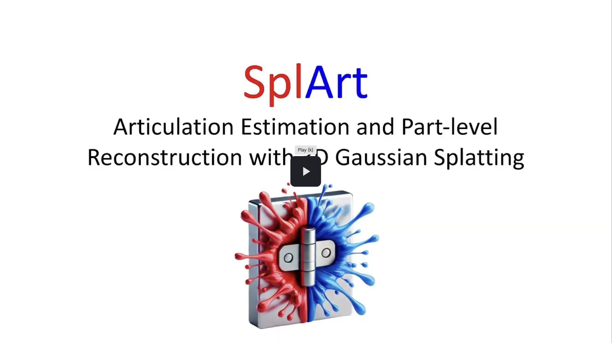

# SplArt

Articulation Estimation and Part-level Reconstruction with 3D Gaussian Splatting.

[](https://drive.google.com/file/d/1bandCsF11xfTkXEzsQZ0dmfUMZBOCH9k/view?usp=sharing)

## Installation

```bash
# If support for multiple CUDA architectures is desired, set TORCH_CUDA_ARCH_LIST accordingly and put the line in ~/.profile or ~/.bash_profile
export TORCH_CUDA_ARCH_LIST='7.0 7.5 8.6 8.9'
```

```bash
CONDA_ENV=splart
conda deactivate && conda env remove -n $CONDA_ENV -y
conda create -n $CONDA_ENV -y python=3.11 && conda activate $CONDA_ENV  # sapien supports up to Python 3.11
conda install -y colmap ffmpeg nvidia/label/cuda-12.4.1::cuda-toolkit
pip install torch torchvision --index-url https://download.pytorch.org/whl/cu124
# TCNN_CUDA_ARCHITECTURES is needed only if support for multiple CUDA architectures is desired (set it accordingly)
TCNN_CUDA_ARCHITECTURES='70,75,86,89' LIBRARY_PATH=$CONDA_PREFIX/lib/stubs${LIBRARY_PATH:+:$LIBRARY_PATH} pip install ninja git+https://github.com/NVlabs/tiny-cuda-nn/#subdirectory=bindings/torch
pip install git+https://github.com/nerfstudio-project/nerfstudio.git@2adcc380c6c846fe032b1fe55ad2c960e170a215  # latest as of 06/01/2025
pip install git+https://github.com/nerfstudio-project/gsplat.git@0b4dddf04cb687367602c01196913cde6a743d70  # latest as of 06/01/2025. Ignore error "nerfstudio 1.1.5 requires gsplat==1.4.0, but you have gsplat 1.5.2 which is incompatible."
pip install huggingface-hub imageio-ffmpeg ipympl kornia "numpy<2" sapien  # sapien crashes with NumPy 2
pip install git+https://github.com/facebookresearch/pytorch3d.git
pip install git+https://github.com/facebookresearch/sam2.git
git clone --recurse-submodules https://github.com/cvg/Hierarchical-Localization.git ../Hierarchical-Localization && pip install -e ../Hierarchical-Localization
pip install git+https://github.com/shengjie-lin/vis-utils.git
pip install -e . --config-settings editable_mode=compat
```

## Datasets

Depending on which datasets you have prepared, the final file structure should resemble the following:

    datasets/splart
    ├── paris-pms
    │   ├── blade
    │   ├── foldchair
    │   ├── fridge
    │   ⋮
    ├── paris-real
    │   ├── real_fridge
    │   └── real_storage
    ├── splart-pms
    │   ├── 100247-Box
    │   ├── 100248-Suitcase
    │   ├── 100460-Bucket
    │   ⋮
    └── splart-real
        ├── cabinet
        ├── glasses
        ├── monitor_1
        ⋮

### SplArt PartNet-Mobility Subset (SplArt-PMS)


The pre-generated dataset is available for download [here](https://drive.google.com/file/d/1rlinQn2NAHJfQed4Tg_cbldeHkDJucaF/view?usp=drive_link). Alternatively, you can generate it yourself, and even include additional objects of your choice, by following the steps outlined below:

1. Download the full PartNet-Mobility Dataset following the [official instructions](https://sapien.ucsd.edu/downloads).

2. Extract the downloaded dataset to match the file structure:

        datasets/partnet-mobility
        ├── 100013
        ├── 100015
        ├── 100017
        ⋮

3. Generate SplArt-PMS:

    ```bash
    python prep_splart_pms.py
    ```

### SplArt Real-World Dataset (SplArt-Real)


You can download the prepared dataset [here](https://drive.google.com/file/d/1CE6XvYYYyGXOTpMyzwOSdofrnHI8cKUQ/view?usp=drive_link).

### Preparing Your Own Real-World Dataset

Refer to the exemplar Jupyter notebooks in the `demos` directory, which illustrate the preparation process for the SplArt-Real Dataset.

### PARIS PartNet-Mobility Subset (PARIS-PMS)

We have converted the original dataset to be compatible with SplArt, which can be downloaded [here](https://drive.google.com/file/d/1zdNa5WTtc8ScLRSRQ0BnCHz_dSWV9t6_/view?usp=drive_link).

### PARIS Real-World Dataset (PARIS-Real)

We have converted the original dataset to be compatible with SplArt, which can be downloaded [here](https://drive.google.com/file/d/1C-LLmm9HGovQV0IyO7UUsG_2LZS85yos/view?usp=drive_link).

## Training

Here's an example to train SplArt on a specific object (103031-CoffeeMachine) in SplArt-PMS.

```bash
dataset=splart-pms
obj=103031-CoffeeMachine
timestamp=$(date -u +%Y-%m-%dT%H:%M:%SZ)
ns-train splart \
    --output-dir model_ckpts/$dataset \
    --experiment-name $obj/$timestamp \
    --vis wandb \
    --data datasets/splart/$dataset/$obj \
    --max-num-iterations 25000 \
    --pipeline.model.num-random 999999 \
    --pipeline.model.random-scale 1.3
```

## Evaluation

### Qualitative Evaluation

`python splart_renderer.py --dataset $dataset --scene $obj --timestamps $timestamp`

It will save the rendering to `outputs/renders/$dataset/$obj/$timestamp`.

### Quantitative Evaluation

`python eval.py --dataset $dataset --timestamp $timestamp`
